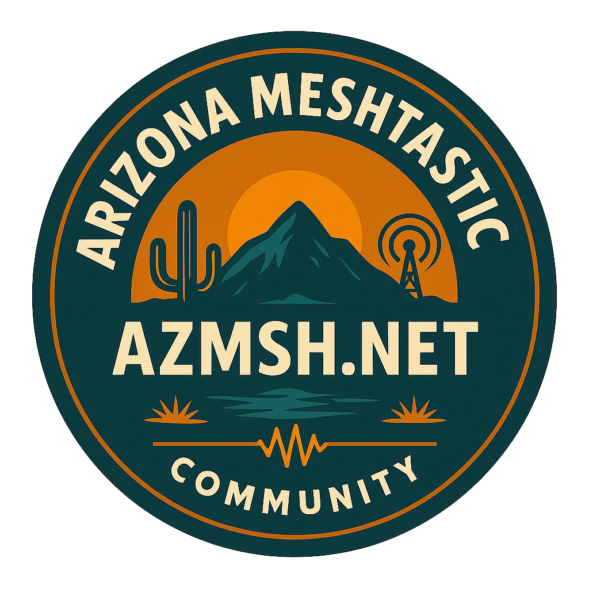

<div align="center">



# AZMSH Educational Materials

Presentations, brochures, and guides for learning Meshtastic in Arizona.

[](https://azmsh.net)
[](https://meshtastic.org)
[](https://discord.gg/HrKtyuFEQk)

[Website](https://azmsh.net) · [Join Discord](https://discord.gg/HrKtyuFEQk) · [Browse materials](#available-materials)

</div>

## About

Educational materials from the Arizona Meshtastic Community (AZMSH) for meetups, classes, and anyone setting up a radio.

Each folder contains one presentation, brochure, or guide and its supporting files. The getting-started presentation is available now. More materials will be added here.

## Available materials

| Material | Format | Contents |
| --- | --- | --- |
| [Getting Started with Meshtastic](powerpoint-getting-started/README.md) | Browser presentation | 17 slides covering setup, regional settings, channels, node roles, hardware prices, and community chats |

## View the presentation

Download or clone this repository, then open `powerpoint-getting-started/AZMSH Getting Started.dc.html` in your browser. Keep the presentation folder intact so its images and scripts can load.

Use the arrow keys or on-screen controls to change slides. The deck scales to the browser window and supports touch navigation. Fonts, icons, and runtime dependencies need internet access.

For local server instructions and editing details, see the [presentation README](powerpoint-getting-started/README.md).

## Repository layout

```text
.
├── README.md
├── .gitignore
└── powerpoint-getting-started/
    ├── README.md
    ├── AZMSH Getting Started.dc.html
    ├── hardware-research.md
    ├── assets/
    ├── _ds/
    ├── deck-stage.js
    └── support.js
```

Add future resources in separate folders at the root, such as `brochure-getting-started/` or `guide-node-placement/`. Those folders have not been added yet.

## Contributing

Found a mistake? Open an issue or submit a pull request. For new materials:

1. Put each resource in a folder with a descriptive, lowercase name separated by hyphens.
2. Add a short README explaining who the material is for and how to open or edit it.
3. Keep source files and images together. Add a PDF for materials meant to be printed.
4. Link to sources for technical information. Include the date when listing prices or recommended settings.
5. Use plain language without em dashes, slogans, or filler. Preserve channel names and keys exactly.
6. Leave credentials, private information, and temporary working files out of commits.

Hardware prices in the presentation were checked September 9, 2026. Confirm current pricing and availability through the [manufacturer links](powerpoint-getting-started/hardware-research.md). Check [AZMSH](https://azmsh.net) for current regional settings.

## Community

| Where | Details |
| --- | --- |
| Website | [azmsh.net](https://azmsh.net) |
| Discord | [Join the AZMSH server](https://discord.gg/HrKtyuFEQk) |
| Sunday radio chat | 5 pm on primary MediumFast |
| Monday voice chat | 7 pm on Discord |
